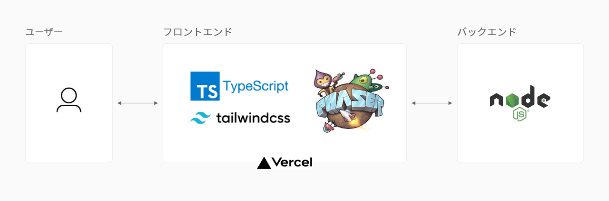

## 全4種類のトランプゲームが遊べるウェブアプリケーション

CPU対戦限定で、以下4種類のトランプゲームがプレイできます。

- ブラックジャック
- ポーカー
- 戦争
- スピード

また、ゲーム別にCPUの強さやラウンド数の調整が可能です。
あなた好みの楽しみ方で、ちょっとした空き時間のお供に。

## 技術スタック

- プラットフォーム : Web
- アーキテクチャ : MVC
- フロントエンド : TypeScript + Phaser3 + TailwindCSS
- バックエンド : Node.js
- 言語 : TypeScript
- フレームワーク : Phaser3 Game Framework
- ビルドツール : Vite
- ソフトウェアプラットフォーム : Docker
- デプロイ : Vercel

### 将来実装したいと考えている機能について

- ログイン機能の追加

### その他の開発内容を確認する

- [要件定義](https://github.com/Frontend-teamDevC/playing-card/wiki/%E8%A6%81%E4%BB%B6%E5%AE%9A%E7%BE%A9)
- [規約](https://github.com/Frontend-teamDevC/playing-card/wiki/%E8%A6%8F%E7%B4%84)
- [設計](https://github.com/Frontend-teamDevC/playing-card/wiki/%E8%A8%AD%E8%A8%88)
- [開発ログ](https://github.com/Frontend-teamDevC/playing-card/wiki/%E9%96%8B%E7%99%BA%E3%83%AD%E3%82%B0)

## ゲームの遊び方

#### はじめに

最初にあなたの名前を設定します。

> [!NOTE]
> 設定した名前はプレイ画面に表示されます。

#### ゲームをプレイする

1. ゲーム選択画面でプレイするゲームを選択します。
2. ゲーム詳細画面の「ゲームを始める」でゲームをプレイできます。

#### ゲームの遊び方を確認する

1. ゲーム詳細画面の「遊び方を見る」を選択します。
2. 遊び方画面で「遊び方」を確認します。

> [!TIP]
> その他「ヒント」などのゲームに役立つ知恵も用意しています。画面上部のナビゲーションからタブを切り替えて確認してください。

## 共同制作者

- [SouthernMinami](https://github.com/SouthernMinami)
- [daxchx](https://github.com/daxchx)
- [m0rio0818](https://github.com/m0rio0818)
